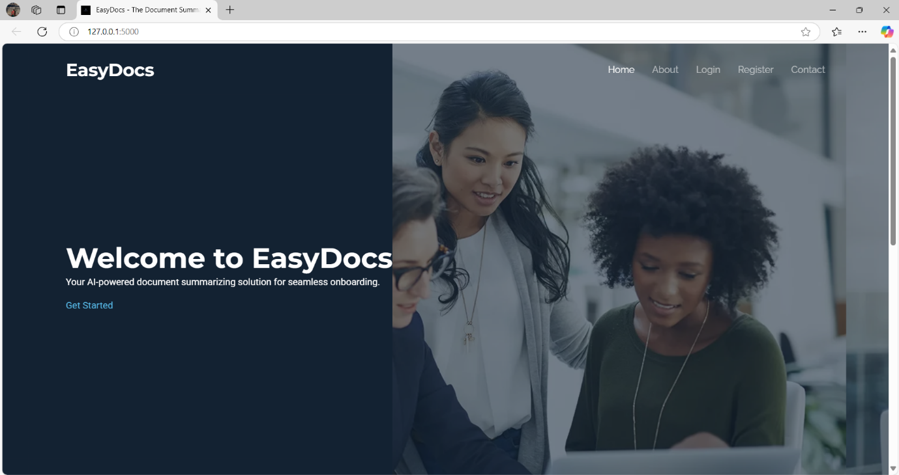
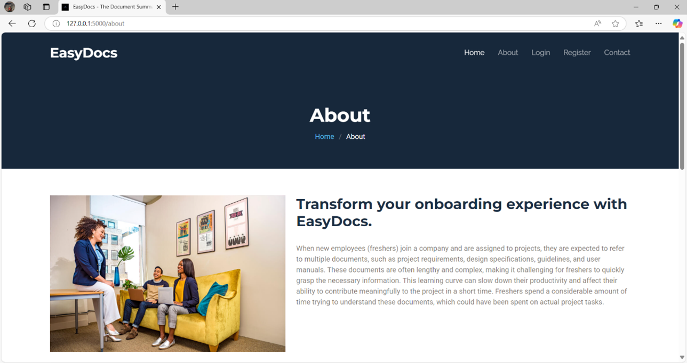
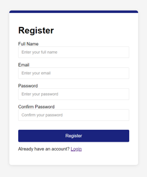
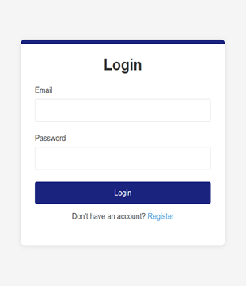
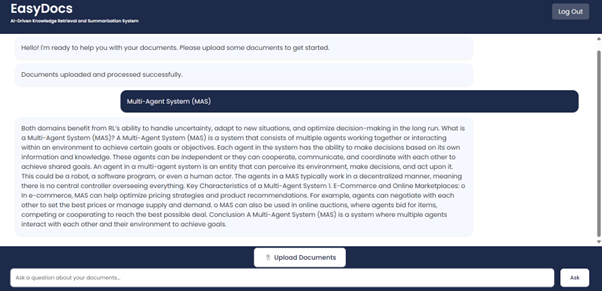

# EasyDocs Web

EasyDocs Web is a document-based intelligent chatbot system that enables users to upload various documents (PDF, TXT, DOCX) and ask natural language questions to extract specific information using NLP and RAG techniques.

## 🌐 Features

- 📄 Upload documents in PDF, TXT, or DOCX format
 
- 🤖 Chat with an AI that answers based on the uploaded document
 
- 🔍 Natural Language Processing (NLP) for semantic understanding
 
- 🧠 Retrieval-Augmented Generation (RAG) for precise responses
 
- 💬 Interactive web interface with smooth chat UI
 
- 🔐 Optional authentication for managing sessions

## 🛠️ Technologies Used

- **Frontend**: HTML, CSS, JavaScript, Bootstrap
- **Backend**: Python (Flask)
- **AI/NLP**: 
  - TF-IDF Vectorization
  - Cosine Similarity
  - Question Answering Logic
- **PDF/DOCX Parsing**: `PyMuPDF`, `python-docx`
- **Deployment**: Localhost or any Flask-compatible hosting
- **Authentication**: Firebase Authentication

## 🔐 Firebase Integration

This app uses **Firebase Authentication** to handle user login and session management.

> 📌 To enable it:
> 1. Go to [Firebase Console](https://console.firebase.google.com/)
> 2. Create a project and enable Email/Password authentication
> 3. Replace Firebase config in `static/js/firebase.js` or equivalent


## 🚀 Getting Started

### 1. Clone the repository

```bash
git clone https://github.com/Niranjana261102/EasyDocs_Web.git
cd EasyDocs_Web
```

## 📷 Screenshots

### 🔹 Home Screen


### 🔹 About Screen


### 🔹 Register Screen


### 🔹 Login Screen


### 🔹 Chat Interface



